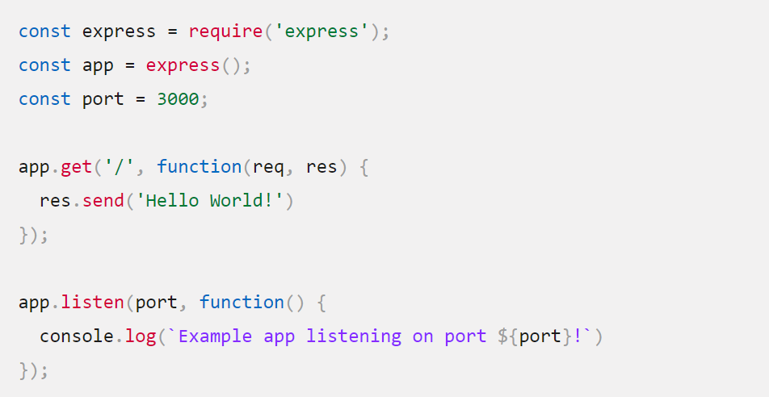

# Express 👋 👩🏻‍💻

- Introduction to NodeJS.
- Introduction to Express.
- What is NPM?
- What is TDD?
- CI/CD.
 
 

# Introduction to NodeJS

  It is portable and an open-source, cross-platform runtime environment that allows developers to create all kinds of server-side tools and applications in JavaScript,And it is lightweight web application framework

  The runtime is intended for use outside of a browser.

    => Node has a benefits for the web server development:

  a. Optimize throughput and scalability in web applications and is a good solution for many common web-development problems.

  b. less time is spent dealing with "context shift" between languages when you're writing both client-side and server-side code.

  c. The node package manager (NPM) provides access to  reusable packages also be used to automate most of the build toolchain.

  d. Node.js is portable

  e. It has active third party ecosystem and developer community, And you can use Node.js to create a simple web server using the Node HTTP package.
 
 

# Introduction to Express

  Express is Node web framework, and is the underlying library for a number of other popular Node web frameworks.

## What Express can provides ?

    It provides mechanisms to:

  a. Write handlers for requests with different HTTP verbs at different URL paths (routes).
  
  b. Integrate with "view" rendering engines in order to generate responses by inserting data into templates.
  
  c. Set common web application settings like the port to use for connecting, and the location of templates that are used for rendering the response.
  
  d. Add additional request processing "middleware" at any point within the request handling pipeline.

## Most Important Methods of Express

- POST.
- PUT.
- DELETE.
- GET.

## Helloworld Express Example

 
 
 

# What is NPM?

 Npm is the world's software registry. Open source developers used to share and borrow packages.

 Also it is used to manage private development as well

    npm consists of three distinct components: 🖍

- the website
- the Command Line Interface (CLI)
- the registry

##

    When and how we can use NPM ?

- Adapt packages of code for your apps, or incorporate packages as they are.

- Download standalone tools you can use right away.

- Run packages without downloading using npx.

- Share code with any npm user, anywhere.

- Restrict code to specific developers.

- Create organizations to coordinate package maintenance, coding, and developers.

- Form virtual teams by using organizations.

- Manage multiple versions of code and code dependencies.

- Update applications easily when underlying code is updated.

- Discover multiple ways to solve the same puzzle.

- Find other developers who are working on similar problems and projects.

 
 

# What is TDD?

   Test-driven development that
refers to a style of programming .

    refers to a style of programming three activities are tightly interwoven:

- coding.
- testing (in the form of writing unit tests).
- design (in the form of refactoring).

##

     TDD can be succinctly described by the following set of rules:

- Write a “single” unit test describing an aspect of the program.

- Run the test, which should fail because the program lacks that feature.

- Write “just enough” code, the simplest possible, to make the test pass.

- “Refactor” the code until it conforms to the simplicity criteria.

- repeat, “accumulating” unit tests over time.

##

    Common Pitfalls:

- forgetting to run tests frequently.

- writing too many tests at once.

- writing tests that are too large or coarse-grained.

- writing overly tests, for instance omitting assertions.

- writing  overly  tests for code.

# CI/CD

## CI

"Continuous Integration":is a workflow strategy that helps ensure everyone's changes will integrate with the current version of the project. This lets you catch bugs, reduce merge conflicts, and have confidence your software is working.

CI :

- ensure everyone's changes integrate

- catch bugs

- reduce merge conflicts

## CD

"Continuous Delivery":

is the practice of developing software in such a way that you could release it at any time. When coupled with CI, continuous delivery lets you develop features with modular code in more manageable increments.

 CD :

- develop to release at any time Continuous Deployment

- deploy new features immediately

 
 

[=> Back to the main page](README.md)
